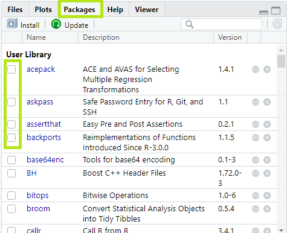

### TIP

Si no sabe armar un vector o no tiene ni puta idea, haga un curso de R, o mire el apunte Rstudio

## Pre-procesado en R

**Antes de todo** : Fija que estés parado en el directorio de trabajo

Para cargar la librería (`package`) en R, existen dos formas: La primera es en lineá de comandos

 ````R
library(nombre_paquete)
 ````

La segunda mas usada, es tildar con un **check** al paquete en la sección `packages` de la derecha, esto equivale a escribir la lineá de comandos de arriba



> Ojo: no estamos instalando (algo nuevo) sino cargando paquetes que ya vienen en R. Los cargamos al proyecto para poder usarlos. Como numpy en Python

````R
# Importar el dataset
dataset = read.csv('Data.csv')
# NO es necesario separar los DEP y los IND
````

### Tratamiento de los NaN

<span style="background:yellow;">REPASITO de R</span>

````R
# mean(x, na.rm = FALSE )
# x : es el vector de entrada
# na.rm : se usa para eliminar los valores faltantes(NA) del vector de entrada (los_na.remove)
x <- 1:5   # x = [1,2,3,4,5]
mean(x)
3

# ave(x, .., FUN = mean) devuelve un vector de la misma longitud que el vector de entrada. Cada elem sera reemplazado por (mean)
ave(x) # La FUN por defecto es =mean
3 3 3 3 3
````

Para acceder a las columnas con ($)

```R
dataset$Age = ifelse(is.na(dataset$Age),  # El x es el vector
                     ave(dataset$Age, FUN = function(x) mean(x, na.rm = TRUE)),
                     dataset$Age)
# En ave() : Cada elemento sera reemplazado por 'mean'
# ave(...) = [mean, mean, ... , mean] => con igual len(dataset$Age)             # Ver Apunte Rstudio\ifelse       
```

